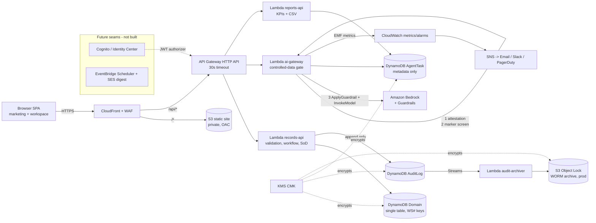
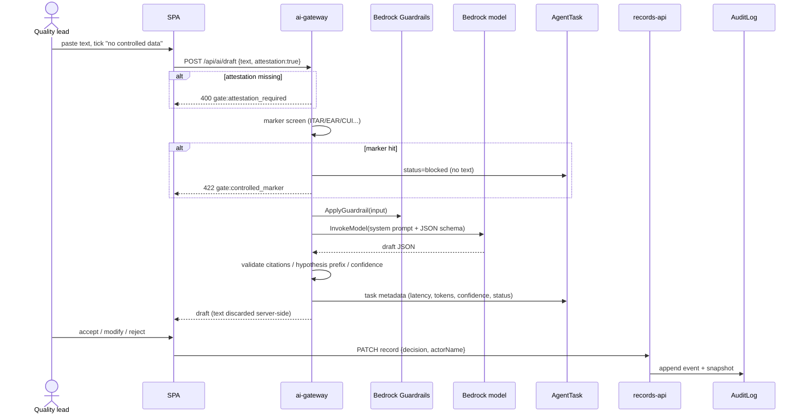
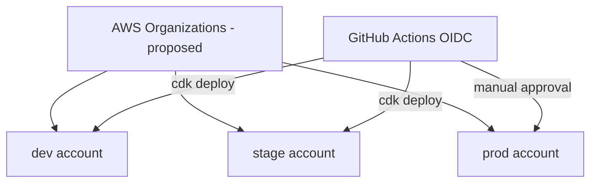

# SentinelQA — Architecture Diagrams
Status: Proposed. See [architecture-overview.md](architecture-overview.md).

## Component view

```mermaid
flowchart LR
  U[Browser SPA<br/>marketing + workspace] -->|HTTPS| CF[CloudFront + WAF]
  CF -->|/*| S3W[(S3 static site<br/>private, OAC)]
  CF -->|/api/*| API[API Gateway HTTP API<br/>30s timeout]
  API --> RA[Lambda records-api<br/>validation, workflow, SoD]
  API --> AG[Lambda ai-gateway<br/>controlled-data gate]
  API --> RP[Lambda reports-api<br/>KPIs + CSV]
  RA --> DDB[(DynamoDB Domain<br/>single table, WS# keys)]
  RA -->|append only| AL[(DynamoDB AuditLog)]
  AG -->|1 attestation<br/>2 marker screen| AG
  AG -->|3 ApplyGuardrail + InvokeModel| BR[Amazon Bedrock<br/>+ Guardrails]
  AG --> AT[(DynamoDB AgentTask<br/>metadata only)]
  RP --> AT
  AL -->|Streams| ARC[Lambda audit-archiver]
  ARC --> OL[(S3 Object Lock<br/>WORM archive, prod)]
  AG -->|EMF metrics| CW[CloudWatch metrics/alarms]
  CW --> SNS[SNS -> Email / Slack / PagerDuty]
  KMS[KMS CMK] -.encrypts.-> DDB & AL & AT & OL
  subgraph Future[Future seams - not built]
    COG[Cognito / Identity Center]
    SCH[EventBridge Scheduler + SES digest]
  end
  COG -.JWT authorizer.-> API
```

## AI draft sequence (controlled-data gate)

```mermaid
sequenceDiagram
  actor QL as Quality lead
  participant SPA
  participant AG as ai-gateway
  participant GR as Bedrock Guardrails
  participant M as Bedrock model
  participant AT as AgentTask
  participant RA as records-api
  participant AL as AuditLog
  QL->>SPA: paste text, tick "no controlled data"
  SPA->>AG: POST /api/ai/draft {text, attestation:true}
  alt attestation missing
    AG-->>SPA: 400 gate:attestation_required
  end
  AG->>AG: marker screen (ITAR/EAR/CUI...)
  alt marker hit
    AG->>AT: status=blocked (no text)
    AG-->>SPA: 422 gate:controlled_marker
  end
  AG->>GR: ApplyGuardrail(input)
  AG->>M: InvokeModel(system prompt + JSON schema)
  M-->>AG: draft JSON
  AG->>AG: validate citations / hypothesis prefix / confidence
  AG->>AT: task metadata (latency, tokens, confidence, status)
  AG-->>SPA: draft (text discarded server-side)
  QL->>SPA: accept / modify / reject
  SPA->>RA: PATCH record {decision, actorName}
  RA->>AL: append event + snapshot
```

## Environments

```mermaid
flowchart TB
  ORG[AWS Organizations - proposed] --> DEV[dev account]
  ORG --> STG[stage account]
  ORG --> PRD[prod account]
  GH[GitHub Actions OIDC] -->|cdk deploy| DEV
  GH -->|cdk deploy| STG
  GH -->|manual approval| PRD
```
